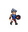

# Deck & Dungeons: Rolling in to Darkness

**วิชา**: CP352203-Computer Game Development  
**ภาคการศึกษาต้น ปีการศึกษา 2568**

## ผู้จัดทำ  
- กมลลักษณ์ พลกูล - 663380030-4 (CP-AI sec2)
- ภานุวัชร์ นุ่นหลักคำ - 663380289-3 (CP-AI sec1)
- ชัชติยะ สินธุธรรม - 663380032-0 (CP-AI sec1)
- กฤติศักดิ์ นนทะคำจัน - 663380250-0 (CP-AI sec1)

---

## แนวเกม/ธีม

- RogueLike
- Action Fantasy
- Turn-Base Card Battle

---

## เนื้อเรื่องย่อ

> เรื่องราวเริ่มต้นขึ้นเมื่อ “Asta”  ในฐานะนักผจญภัยฝึกหัดที่ยังไม่ไม่มีประสบการณ์ได้มุ่งหน้าเข้าสู่ดันเจียน ด้วยความหวังและความฝันที่อยากเป็นนักผจญภัยมืออาชีพแต่เส้นทางไม่ได้โรยด้วยกรีบกุหราบ ผู้เล่นจะต้องช่วย “Asta” เผชิญหน้ากับมอนสเตอร์อันตรายในดันเจียนมากมาย และบอสมอนสเตอร์สุดอันตราย	ภายในนั้นไม่ได้มีเพียงแค่สมบัติหรือพลังวิเศษซ่อนอยู่เบื้องหลังความมืดมิดของดันเจียนยังซ่อนความลับที่อาจเปลี่ยนชะตาของทั้งอาณาจักร ผู้เล่นจะเป็นผู้กำหนดว่า “Asta” จะก้าวขึ้นเป็นนักผจญภัยผู้ยิ่งใหญ่ หรือพ่ายแพ้ต่อเงามืดที่รอคอยอยู่... ในระหว่างการเดินทางผู้เล่นจะสามารถช่วย “Asta” เปิดเผยความลับของอาณาจักร และมุ่งสู่ความฝันสูงสุดของเขาได้หรือไม่…."

---

## ตัวละคร

### 1. Asta Sinika (ตัวเอก)  

---

### 2. Monster 1  

---

### 3. Monster 2  

---

### 4. Monster 3  

---

### 5. Monster 4  

---

### 6. Boss  

---

## Screenshots

---

## ทดลองเล่น

เปิด [Deck & Dungeons: Rolling in to darkness](https://panuwat-noonlukkam.itch.io/deck-dungeons-rolling-in-to-darkness)

---

## เครดิต

[Refferance](https://github.com/guladam/deck_builder_tutorial/tree/season-1-code)
## ตัวละคร
[Player](https://brullov.itch.io/generic-char-asset)
## Fronts
[Fronts](https://datagoblin.itch.io/monogram)
## Icon
[Icon](https://clockworkraven.itch.io/raven-fantasy-icons)
### Monster
-[Monster1 ,Monster2 asset](https://craftpix.net/freebies/free-swamp-bosses-pixel-art-character-pack/?num=1&count=870&sq=monster%20pixel&pos=2)
-[Monster3 ,Monster4 asset](https://craftpix.net/freebies/free-desert-enemy-sprite-sheets-pixel-art/?num=1&count=870&sq=monster%20pixel&pos=5)
-[Boss](https://clembod.itch.io/bringer-of-death-free)
-[Monster attack sound](https://freesound.org/people/qubodup/sounds/773739/)
-[Player attack_sound](https://pixabay.com/sound-effects/sword-blade-slicing-flesh-352708/)
-[Boss attack sound](https://pixabay.com/sound-effects/sword-slash-and-swing-185432/)
-[Armor sound](https://pixabay.com/fr/sound-effects/metal-hit-15-193280/)

